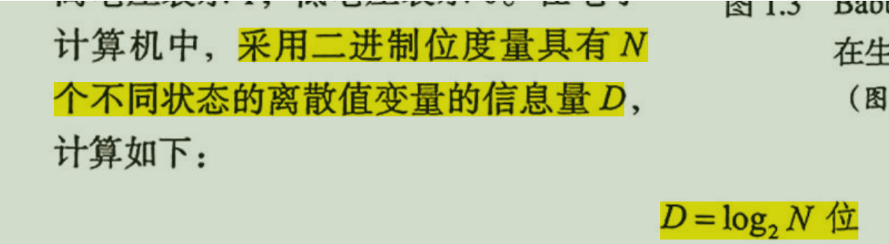
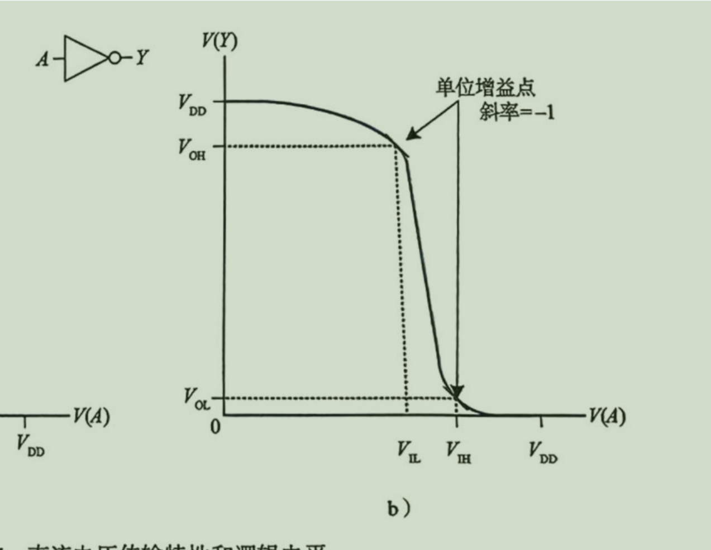
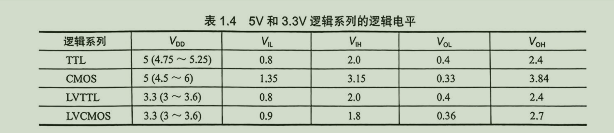
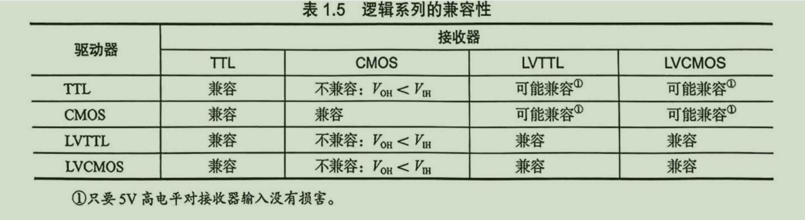

# chapter1  数字系统

## 1.1 *whole structure*

from low to high

this is very thoughts-provoking
when we do any work ，we need to know which layer we're in.

微体系架构是ISA的具体实现 用于根据规范设计电路
体系架构是ISA 所在的，根据ISA 可以知道系统提供了哪些接口，用于OS 或者编译器开发 参考 ，他们就不需要关心底层的电路实现 。   
## 1.2 *complexity management*

1. abstraction ： conceal unimpottant detail，把一个东西进行抽象化
2. discipline : 准则 ，有统一的标准对于相同模块，便于更换和复用
3. 3 Y ：1. hierarchy 层次化 ，系统分为大模块，大模块可分为小模块，直到不可再分。
         2. modularity 模块化 ： 每一个模块定义明确的接口和功能，相互调用，相互使用，所以组合，不产生相互影响。
         3. regularity  规整化：定义通用模块。 

## 1.2 *binary*

1. 信息量 ：    N个不同状态 在m进制下需要的位数
2. 半子 nibble
3. 字的概念 字长
4. 2^10 = 10^3
5. 一千字节 1024 KB  容量单位  ， 速度单位 一千 10^3 Kb/s

## 1.3 *logic gate*

1. buffer 在数字抽象层 无意义 但是实际中 用于大电流和多个门输入，可见抽象会损失细节，了解多个抽象层才会充分理解系统
2. 噪声容限 ：VOH - VIH  
3. 选择 单位增益点 噪声容限最高 .
4.静态准则： 有效输入 必定产生有效输出
5. logic fmily : TTL 晶体管晶体管  LV ：低电压

5v 可能兼容体现在低电压的是否会损坏